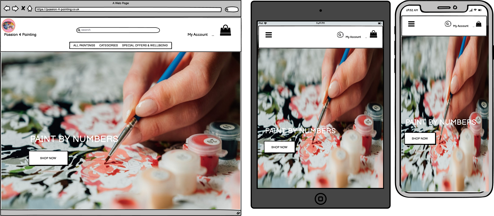
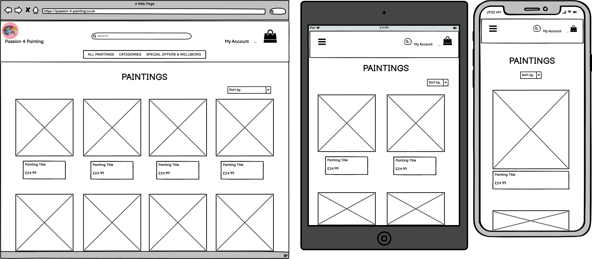
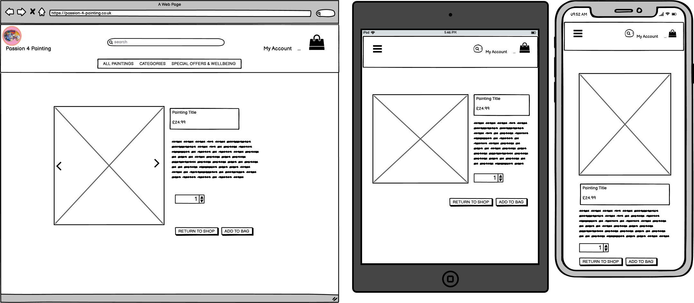
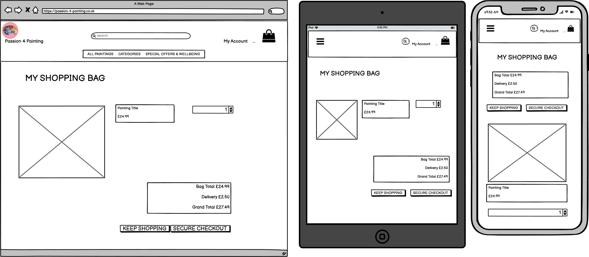
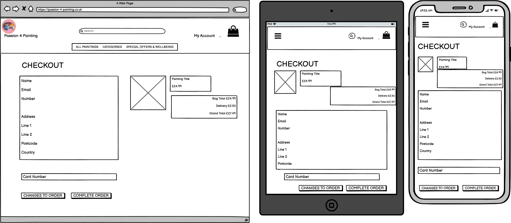

<h1 align="center"></h1>

[View the live website here.](https://passion-4-painting.herokuapp.com/)

## Table of Contents

- [Overview](#BitterSweet-Overview)
- [Things to consider](#Things-to-consider)
- [UX](#UX)  
    - [User Stories](#User-stories)
    - [Design](#Design)
    - [Wireframes](#Wireframes-page-designs)
    - [Database](#Database)
- [Features](#Features)
- [Future Features](#Future-Features)
- [Error Handling](#Error-Handling)
- [Technologies Used](#Technologies-Used)
    - [Languages](#Languages-Used)
    - [Frameworks](#Frameworks,Libraries-&-Programs-Used)
- [Testing](#Testing)
    - [Testing User Stories](#Testing-User-Stories)
    - [Further Testing](#Further-Testing)
    - [Bugs](#Known-Bugs)
- [Deployment](#Deployment)
- [Future Maintainability](#Future-maintainability)
- [Credits](#Credits)
    - [Content](#Content)
    - [Media](#Media)
- [Acknowledgements](#Acknowledgements)

# Passion 4 Painting Overview

## Things to consider

1. Goods to sell that can be grouped into categories
2. Using Django as a framework.
3. The C.R.U.D functionality - site owners must be able to add, read, update and delete the products on the store.
4. A search function to locate products by name/ category or description .
5. The site must be user friendly and visually appealing.
6. A user can register on the site but does not have to in order to make a purchase.

# UX

## User stories

|**As a/an**|**I want to be able to...**|**So that I can...**|
|:-----|:-----|:-----|
|Shopper|View a list of the products available to purchase on the site|See if there is anything I wish to purchase|
|Shopper|View the details of each product available easily|See the price, product details and image clearly|
|Shopper|See if there are any sales or discounts available easily|Save some money on my purchase by taking advantage of the sales etc|
|Shopper|See the total of my basket at all times and be able to view the items in there also|Be aware of how much I might be spending if I were to purchase the items, and to review what I have selected to purchase|
|Site User|Register for an account on the website if I choose and be able to login and out with ease|Store my personal info on the site to make future purchases faster|
|Site User|Receive emails to confirm my registration|Know that my registration was successful|
|Site User|See my order history on my user profile|View my order history and save my information|
|Shopper|Search and sort the products into categories/price etc|See what is on offer and make an informed decision about what I want based on the product info, be able to search for a specific product.|
|Shopper|Adjust the quantity of the items in the ‘basket’ or delete them entirely|Have control over the items I want to purchase and change my mind if necessary|
|Shopper|Feel that the payment system of the site is secure and legit|Be happy to give the necessary information to proceed with the purchase|
|Shopper|See my order confirmation when I have made my payment|Be sure I have entered the correct info and the products were also correct|
|Shopper|Receive an email to confirm the details of my order with an estimated shipping time|Maintain records of my purchases and be informed of when the item may be received |
|Store Owner|Add new products to store|Add new items to the store to be purchased at any time|
|Store Owner|Edit/Update products or Delete them if needed|Change the products details including price, description or image. Or remove items that are sold out or no longer for sale.|

-   ### Design
    -   #### Colour Scheme
        -   The main colours used are shades of pink and blue, as these complement each other nicely and go with the logo I created, with the some of the text being white, black or blue depending on the background colour and content. The site is supposed to seem colourful as it is about painting, which is a creative pastime, but still allow users to clearly read and navigate the site.
    -   #### Typography
        -   The Nunito font is used for the site as this is clear and easy to read. Sans Serif is the fallback font in case for any reason the font isn't being imported into the site correctly. The font colour throughout is dependent on the background and the type of content to make it stand-out and for ease of reading against the background.
    -   #### Imagery
        -   I created the site logo using Adobe Photoshop and a stock photo located online that I edited to suit my purpose. 
        -   The photos used for the paintings are taken by me of paint by number canvases that I have completed myself over the years at my home.
        -   I created a favicon icon for the browser tab - a smaller version of the logo image.

        

## Wireframes page designs

**Home page:**



**Products page:**



**Product details page:**



**Shopping bag page:**



**Checkout page:**



-   ## Database

    -   The database being used to store all products and customer information is built into Django and can be accessed by the site administrators by typing "/admin" at the end of the web address. Here are screenshots of what it looks like:


To deploy to Heroku I used the Postgres free package. Heroku Postgres is a managed SQL database service provided directly by Heroku. You can access a Heroku Postgres database from any language with a PostgreSQL driver, including all languages officially supported by Heroku. In addition to a variety of management commands available via the Heroku CLI, Heroku Postgres provides a web dashboard, the ability to share queries with dataclips, and several other helpful features. See more information on Postgres [here](https://devcenter.heroku.com/articles/heroku-postgresql)


## Features

-   Responsive on all device sizes. For example:


### Home Page
-    This is the landing page, the first page the users come to - it has a featured image that takes up most of the page with the nav bar that is present on all pages so the site is easy to navigate. The nav bar also contains the search function which the users can see and make use of at any time - it is hidden on mobile by the hamburger icon, but it is still accessible on every page. There is a simple text to state 'Paint by Numbers' and a large 'Shop Now' button to take the users straight into the site.

### Products Page
-    This page lays out the products for sale - in this instance the paint by number kits the users can purchase. They are displayed in a neat grid that is fully responsive to screen sizes. They contain the product image, name, price and category. Clicking on them will direct the user to the product details page. The user is able to sort the products by name, by price or by category - whichever they prefer.

### Product Details Page
-    This page shows a larger image of the product the user has chosen and a bit of a blurb about the product - I also added an image carousel to this page so the users can change the image to a picture of the 'kit' that comes with each painting - this matches the description. The users have the ability to choose a quantity and either add the item to their shopping bag or go back to the store.

### Shopping Bag Page
-    This page shows the user their shopping bag - if there is nothing there it informs them and gives them a link to go back to the store. If there are products in the bag it populates with the details of this - as well as giving the users the ability to update their quantity or to remove the item from their bag completely. if they have goods and want to purchase they have buttons at the bottom to either go to a secure checkout or to go back to the store.

### Checkout Page
-    This page has a form for the user to complete in order to purchase the product - it is clear and easy to use. There is also info on this page showing what is to be purchased and the full cost breakdown. Under the card number section there is text to warn the user that their card is to be charged with the grand total - so there can be no misunderstanding and the user is completely clear. There is a cancel or an order button - clicking on the order sends the webhook to stripe and the payment would be taken and the user re-directed to an order confirmation screen which clearly lays out the details of the purchase, which is also emailed to them for their convenience.

### Health and Wellness Page
-    I wanted to create a paint by numbers site that was slightly different from the others that I viewed in research for this project. I personally have been completing paint by numbers for many years because I know about the amazing stress relief and creative outlet that they can be, but with their popularity increasing during the pandemic and lockdown I wanted to add a section on my site to highlight the benefits of paint by numbers as a healthy past-time. I therefore added a health and wellness page which takes the user to a page that lists many of the most important benefits to painting as well as a brief explanation of each. I also included links to studies completed for further validation of the points and for the user's interest. As credited in this readme - I got the information for this section from [this website](https://ledgebay.com/benefits-of-paint-by-numbers/).

### Future Features

-   I would have liked to include my site logo on all the confirmation emails sent to the users, both when they register for the site and when they make a successful purchase. I think this would have elevated the emails and made them appear alot more professional, however I didn't have time on this project to figure that out.
-   I would have also liked to add additional photos of each painting, such as a photo of it on a wall, that the would be triggered by the mouse hovering over the image. However this would have required alot more photos being taken and I didn't have the time to persue this.
-   If this was a real site I would look to include an option for the user to checkout and pay using Paypal - as this is personally my favourite way to purchse items online, it is faster, more secure and Paypal provides a level of protection for both sellers and shoppers. In my opinion a good ecommerce site utilises Paypal, so I would add this in a real store.

## Error Handling

I created custom error pages so that if the user encounters a page that doesn't exist/deleted/forbidden etc, the stlye of the error page will match the rest of the site. This makes the site more professional.

- 404 Not Found
- 403 Forbidden
- 410 Gone
- 500 Internal Server Error

404 error page example


## Technologies Used

### Languages Used

In this project I used:
-   [HTML5](https://en.wikipedia.org/wiki/HTML5)
-   [CSS3](https://en.wikipedia.org/wiki/Cascading_Style_Sheets)
-   [JQuery](https://jquery.com/) 
-   [Python](https://en.wikipedia.org/wiki/Python_(programming_language))
-   [Django](https://www.djangoproject.com/) 

### Frameworks, Libraries & Programs Used

-   [Bootstrap](https://getbootstrap.com/docs/5.1/getting-started/introduction/) I used Bootstrap's framework for the styling and for responsivness on mobiles.
-   [AWS](https://aws.amazon.com/?nc2=h_lg) I used AWS S3 to store and display my product images.
-   [Stripe](https://stripe.com/en-gb) Stripe payments are how the orders are taken and webhooks sent/received to take the payment and create the order on the datatbase.
-   [Heroku](https://www.heroku.com/home) Heroku is where the site is deployed.
-   [Postgres](https://devcenter.heroku.com/articles/heroku-postgresql) Postgres through Heroku is the deployed datatbase.
-   [Google Fonts:](https://fonts.google.com/) Google fonts were used to import the 'Nunito' font into the base.css file which is used on all pages throughout the project.
-   [Font Awesome:](https://fontawesome.com/) Font Awesome was used on all pages throughout the website to add icons for aesthetic and UX purposes.
-   [GitHub:](https://github.com/) GitHub is used to store the projects code after being pushed from Git.
-   [Git:](https://git-scm.com/) Git was used for version control by utilizing the Gitpod terminal to commit to Git and Push to GitHub.
-   [Responsinator:](http://www.responsinator.com/) Responsinator was used to check the site was responsive across all devices.
-   [Am I Responsive](http://ami.responsivedesign.is/) Am I Responsive was used to demonstrate the site was responsive in the attached screenshots.
-   [Balsamiq:](https://balsamiq.com/) Balsamiq was used to create the wireframes during the design process.
-   [Lighthouse](https://developers.google.com/web/tools/lighthouse)
-   Chrome, Microsoft Edge & Firefox internet browsers.
-   Adobe Photoshop.

## Testing

### Manual Testing documentation

[Please see the testing file](testing.md)

### Validators

I used the following services to validate every page of the project to ensure there were no syntax errors:

-   [W3C Markup Validator](https://validator.w3.org/) This validator doesnt like the Jinja templating - but if you run the code from the page source you can check for any non-jinja errors. There is one error located that I cannot fix - on the nav bar there is a duplicated ID between the large screen nav bar and the mobile nav bar - however as one of these is always hidden there is no issue with this error and it can be ignored.
-   [W3C CSS Validator](https://jigsaw.w3.org/css-validator/)
-   [JSHint](https://jshint.com/)
-   [PEP8 Online Check](http://pep8online.com/) - When I ran the Flake8 command alot of the errors were with the automated code or migrations - so I left them. I had a few line too long errors that I couldnt fix without the code breaking, after my final discussion with my mentor it was agreed to leave them as long as the code was working - as it's not always possible to be completely PEP8 compliant but it's important that the code functions as expected.


### Testing User Stories

- #### Site user goals
    1. As a shopper, I want to be able to see the products clearly for sale, view the details, see if any discounts/deals and see my basket total at all times.
        - The products page aloows the user to see the products for sale and they can click on any of the products to get more info on the product as well as the option to add it to their basket. The nav bar on all pages allows the user to search or view the different categories or deals - and their basket is always visible with the amount of goods if any added showing at all times .

    2. As a site user, I want to register for an account if I choose to, receive confirmation emails for registration and see my order history on my user profile ()if I have one).
        -  The site makes use of Django to create an easy registration and signin/logout functions. To sign up for the site the user must confirm their email address and their profile page is where they can update their details or see any past orders if required.

    3. As a shopper, I want to adjust the quantity of items in my shopping bag or delete them if I change my mind, trust the checkout system, see an order confirmation after a purchase and recieve an email to confirm.
        - The shopping bag page allows the users to adjust the quanity of any of their items added to the bag or to delete them. the checkout system is using Stripe so it is secure and straight forward. The checkout page redirects to an order confirmation page so the user can be sure of their order and an automated email confirmation is also sent to the address they provided when completing the checkout page. A user is not required to register in order to make a purchase.

- #### Site owner goals
    1. As a site owner, I want to add new products to the store whenever I need to. 
        -  If the user is a superuser (so store owner or admin) they have the additional option under My Account to click on Product management. This easy to use form can add any product to the store - if they wish to upload an image they have that option, or a default no-image photo is selected instead.

    2. As a site owner, I want to Edit/Update products or Delete them if needed.
        -  If the user is a superuser (so store owner or admin) they have the additional option on the products page and products description page to edit or delete the product. The edit button takes them to a form much like the add a product form - but already populated. The admin can then change any info or change the picture as required - then update the product. They can also click on the delete option and a security model will open to warn them that a deletion cannot be undone and they then have to click to slete again in order to successfully delete the product from the store.

### Further Testing

-   The Website was tested on Google Chrome, Microsoft Edge and FireFox browsers to check it loaded correctly.
-   The website was viewed on a variety of devices such as Desktop, Laptop and a variety of iPhones & Android phones to check it loaded correctly.
-   The website was tested on Responsinator to ensure responsiveness on all devices.
-   A large amount of testing was done to ensure that all pages were linking correctly. This was done by frequently moving from one page by clicking the button links for 
all pages on all devices.
-   A large amount of testing of the database C.R.U.D functions was completed during development. After every change the site was tested to ensure no new issues or bugs were located.
-   Friends and family members were asked to review the site and documentation to point out any bugs and/or user experience issues, they reported a success on all fronts.
-   The website was tested on [Lighthouse](https://developers.google.com/web/tools/lighthouse) and achieved a high score on performance and a good score on other issues:


    
    You can use the Lighthouse Tool on any webpage by right clicking on the site, then 'inspect', then the two arrow button '>>' and 'Lighthouse'. You can select to test the site 
    as a desktop version or mobile version and then click the blue 'Generate Report' which will provide you with the results in the screenshot provided above.

## Known Bugs

No bugs have been located at the time of Deployment.

## Deployment

### GitHub 

The repository for this project is stored on [GitHub](https://github.com/) and is deployed on [Heroku](https://www.heroku.com/).

In order to add to this project you will need:

- Python 3.8.3 or higher
- Git version control
- Code editor
- GitHub account
- MongoDB account

### Forking the GitHub Repository

By forking the GitHub Repository we make a copy of the original repository on our GitHub account to view and/or make changes without affecting the original repository by using the following steps...

1. Log in to GitHub and locate the [GitHub Repository](https://github.com/Passion4film/Milestone-Project-3)
2. At the top of the Repository (not top of page) just above the "Settings" Button on the menu, locate the "Fork" Button.
3. You should now have a copy of the original repository in your GitHub account.

### Making a Local Clone

1. Log in to GitHub and locate the [GitHub Repository](https://github.com/Passion4film/Milestone-Project-3)
2. Under the repository name, click "Clone or download".
3. To clone the repository using HTTPS, under "Clone with HTTPS", copy the link.
4. Open Git Bash
5. Change the current working directory to the location where you want the cloned directory to be made.
6. Type `git clone`, and then paste the URL you copied in Step 3.

```
$ git clone https://github.com/Passion4film/Milestone-Project-3
```

7. Press Enter. Your local clone will be created.

```
$ git clone https://github.com/Passion4film/Milestone-Project-3
> Cloning into `CI-Clone`...
> remote: Counting objects: 10, done.
> remote: Compressing objects: 100% (8/8), done.
> remove: Total 10 (delta 1), reused 10 (delta 1)
> Unpacking objects: 100% (10/10), done.
```

Click [Here](https://help.github.com/en/github/creating-cloning-and-archiving-repositories/cloning-a-repository#cloning-a-repository-to-github-desktop) to retrieve pictures for some of the buttons and more detailed explanations of the above process.

8. Create a file called env.py for the environment variables, containing:

```console
import os

os.environ.setdefault("IP", "0.0.0.0")
os.environ.setdefault("PORT", "5000")
os.environ.setdefault("SECRET_KEY", "<app secret key>")
os.environ.setdefault("MONGO_URI", "mongodb+srv://<username>:<password>@<cluster_name>-ofgqg.mongodb.net/<database_name>?retryWrites=true&w=majority")
os.environ.setdefault("MONGO_DBNAME", "<database name>")

```
9. **Ensure that env.py is listed in your .gitignore file so that the environment variables are are never made public**
10. The app can now be run locally using
```console
python3 app.py
```

## Deployment to Heroku 

If you have a Heroku account login [here](https://id.heroku.com/login) or create an account.

Before creating a Heroku application there are some files that need to be created to run the app:

* requirements.txt file (which lists the dependencies that are needed for the app) 
* Procfile (this is what Heroku looks for to know which file runs the app, and how to run it)

```console
pip3 freeze --local > requirements.txt
echo web: python app.py > Procfile
```

At Heroku.com you can choose to 'Create a New App' - the name must be unique, in lowercase letters and use dashes instead of spaces.

* Next, select the region closest (doesn't have to be exact - I chose Europe) to you then click 'Create App'.
* For this project I chose to setup 'Automatic Deployment' from my GitHub repository. 
* Make sure your GitHub profile is displayed, then add your repository name then click 'Search'. Once it finds your repo, click to connect to this app.
* DON'T click to Enable Automatic Deployment yet, otherwise you'll get unwanted application errors.

Since environment variables are within a hidden env.py file, Heroku won't be able to read those variables. Click on the 'Settings' tab for your app, and then click on 
'Reveal Config Vars', where we can securely tell Heroku which variables are required. Must match the details in the env.py file you have to create in github.

You will need to set up an AWS S3 Bucket for the images, a Stripe account for the payments and an email account for the emails to be sent from.

Make sure not to include any "quotes" for the key, or the value.

|**Key**|**Value**|
|:-----|:-----|
|AWS_ACCESS_KEY_ID|`access key`|
|AWS_SECRET_ACCESS_KEY|`secret access key`|
|DATABASE_URL|`postgres info`|
|EMAIL_HOST_PASS|`taken from email provider`|
|SECRET_KEY|`secret key`|
|STRIPE_PUBLIC_KEY|`stripe public key from your console`|
|STRIPE_SECRET_KEY|`stripe secret key from your console`|
|STRIPE_WH_SECRET|`stripe webhook secret`|
|USE_AWS|`True`|

* Make sure all changes on GitHub have been added, commited and pushed to GitHub. 
* We can now safely 'Enable Automatic Deployment', as everything should be available on our repository.
* Click 'Deploy Branch'. Heroku will now receive the code from GitHub, and start building the app using the required packages. 
* When this is completed it will state: "Your app was successfully deployed." 
* Click "View" to launch your new app.

## Future maintainability

The images used are stored in an AWS S3 bucket for easy maintainability, 

There is code commenting for for important sections of the HTML pages, which make it easy for developers to view for future maintenence. It makes changing the code/updating the 
details easier for other developers.

There is also a level of code commenting in the CSS, Python & JavaScript/JQuery sections, to ensure if any bugs or errors do occur it will be simple to see what part of the page each section affects. This makes updating and changing the code easier for other developers.

## Credits

### Content

Online tutorials:

* [For the content of the Health and Wellbeing page](https://ledgebay.com/benefits-of-paint-by-numbers/)

* [For the deletion confirmation model - for site admin only](https://www.tutorialrepublic.com/codelab.php?topic=bootstrap&file=delete-confirmation-modal)

* [For the image carousel on product details page - to show a pic of the kit that comes with the painting](https://www.tutorialrepublic.com/twitter-bootstrap-tutorial/bootstrap-carousel.php)


### Media

I created the logo, flavicon, error pages for the site using Adobe Photoshop.

[The logo base image](https://i.pinimg.com/originals/ca/20/d8/ca20d859c1ff063d9482a56d9be19574.jpg)

[The painting kit image](https://images.squarespace-cdn.com/content/v1/5ad8947d2714e5edb7bde89d/1592030962065-YG0VE9TB0QBLQPY8CRI4/DSC_7463.jpg?format=1000w)

[The featured image on the home page](https://www.stylist.co.uk/images/app/uploads/2021/01/26123624/paint-by-numbers-for-adults-crop-1611664653-1920x1006.jpg?w=1680&h=880&fit=max&auto=format%2Ccompress)

All the paintings 'on sale' are photos of my own paintings I have completed myself, from my home. I took all the photographs and edited/uploaded them accordingly.

## Acknowledgements

I received inspiration for this project from the Boutique Ado mini-project as part of the Code Institute course, [example websites](https://www.funpaintbynumbers.com/), Slack message boards as well as much appreciated help from my Mentor; Antonio Rodriguez.

**DISCLAIMER: This project is for educational purposes only, no materials/files are intended for any commercial use**

[Contents](#Table-of-Contents)